# Hacklingo

Hacklingo is a feature-rich mobile application designed to facilitate language learning, cultural exchange, and community engagement. It offers a comprehensive platform for individuals to connect with native speakers, explore different cultures, and enhance their language proficiency through various interactive features.

One of Hacklingo's core functionalities is language exchange through chatting, video calls, and group chats. Users can connect with native speakers of their target language and engage in real-time conversations, allowing them to practice their language skills in an immersive and interactive environment. Whether users are looking to improve their vocabulary, pronunciation, or overall fluency, Hacklingo provides a convenient platform to connect with language partners and exchange knowledge.

In addition to language exchange, Hacklingo offers a forum where users can ask questions, seek advice, and share insights about languages or other countries' cultures. This forum serves as a valuable resource for users to gain a deeper understanding of various languages, cultural practices, traditions, and customs. It promotes dialogue, encourages cultural appreciation, and fosters a sense of community among language learners and enthusiasts.

To assist users in their language learning journey, Hacklingo integrates an English grammar checking feature. This powerful tool analyzes users' written English texts and provides real-time suggestions and corrections, helping them improve their grammar, vocabulary, and overall writing skills. Whether users are composing an email, writing an essay, or crafting a social media post, the grammar checking feature enhances their language accuracy and confidence.

Hacklingo goes beyond language learning by emphasizing cultural exchange. It recognizes that language and culture are intertwined, and understanding a language involves appreciating the customs, traditions, and societal nuances of its native speakers. Through the app's user profiles, users can share information about their culture, traditions, and interests, fostering cross-cultural understanding and promoting friendships based on shared interests and curiosity about different cultures.

Furthermore, Hacklingo offers language-specific channels and interest-based groups where users can connect with like-minded individuals and engage in conversations on specific topics of interest. Whether it's discussing literature, films, music, or hobbies, these channels and groups provide a space for users to deepen their knowledge, expand their vocabulary, and connect with individuals who share similar passions.

Hacklingo aims to create a vibrant and supportive community of language learners, language enthusiasts, and cultural explorers. It provides users with a platform to connect, learn, and grow together. With its user-friendly interface, diverse set of features, and commitment to promoting cultural understanding, Hacklingo is an invaluable tool for individuals seeking to expand their language skills, broaden their cultural horizons, and forge meaningful connections with people from around the world.

In conclusion, Hacklingo is a mobile app that offers a holistic language learning experience. By combining language exchange, cultural exploration, community engagement, and language-specific resources, it provides users with an immersive and enriching platform to enhance their language skills, deepen their cultural understanding, and connect with a global community of language learners and cultural enthusiasts.

# Screenshots

## Login & Sign up

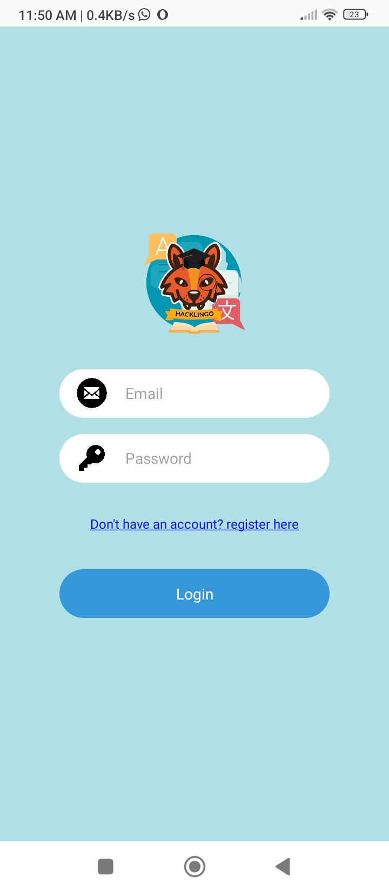

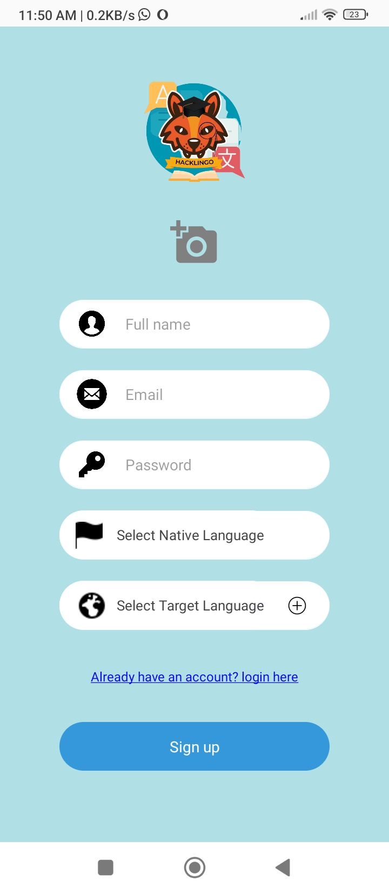

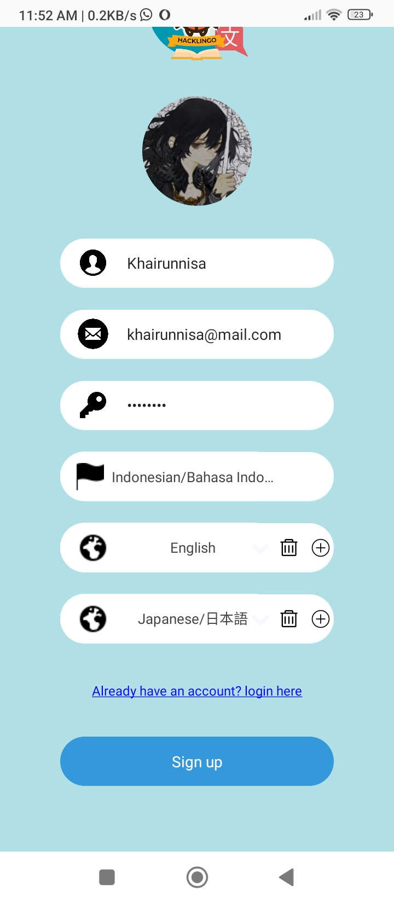

## Landing Page and Article

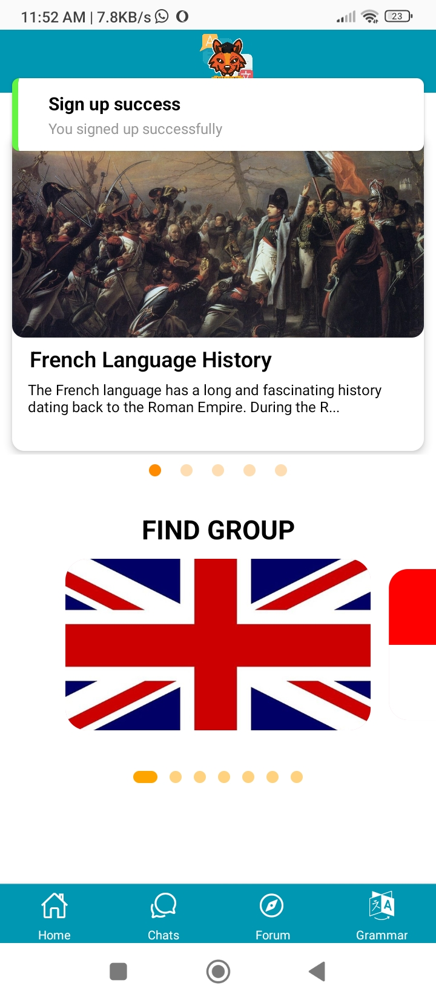

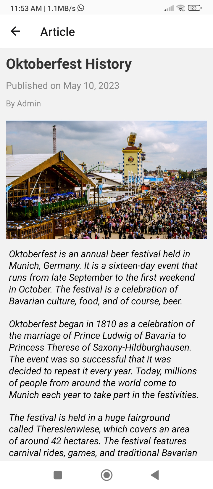

## Chats

## Find Users that you might be interested in

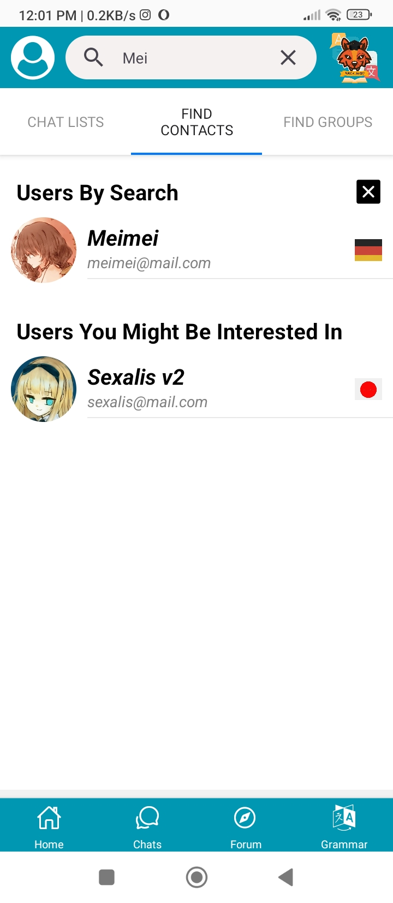

## Learn each other's language and culture

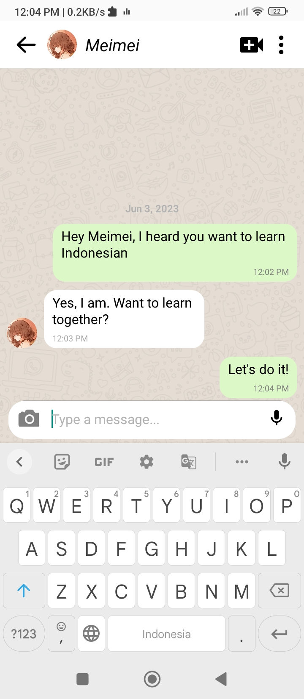

## This app also supports video call

## Find groups for the language that you want to learn

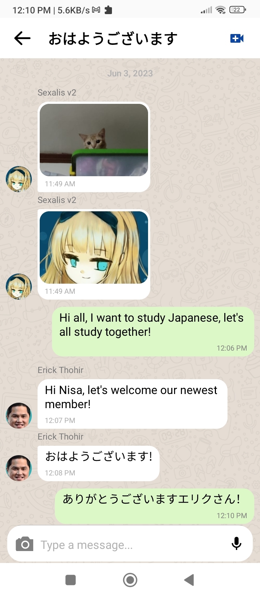

## You can also add pictures in chat

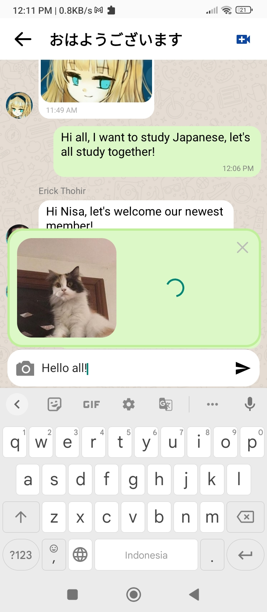

## You can also find posts on the forum of your target language

## Add comment on interesting posts

## Create a post on the forum

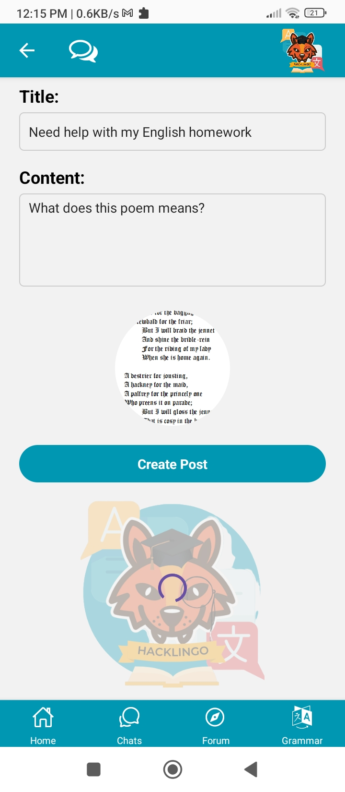

## And you can also get a grammar check!

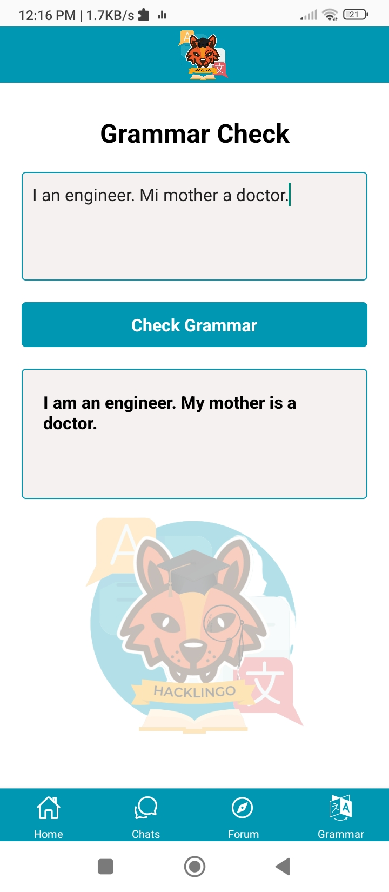

